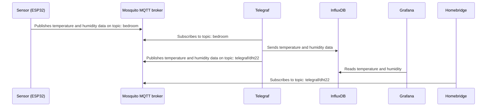

# Climate sensor streaming with Homekit, Telegraf, InfluxDB and Grafana 

This project allows you to monitor and track the climate conditions of your room in real-time using a Raspberry PI and an ESP32 microcontroller. The project utilizes Docker to run the various services, including Homebridge and Telegraf, which act as an interface between the ESP32 and the InfluxDB database. The collected data is then visualized using Grafana, a powerful dashboard tool that enables you to analyze and understand your climate data.



## Sensor
- ESP32 with WiFi-module
- DHT22 
- MicroPython

### Build sensor
```bash
make setup_sensor
```

## Stack
- Mosquitto MQTT
- Telegraf
- InfluxDB
- Grafana
- Homebridge (optional)

### Start the stack with docker compose

```bash
$ docker-compose up
```
